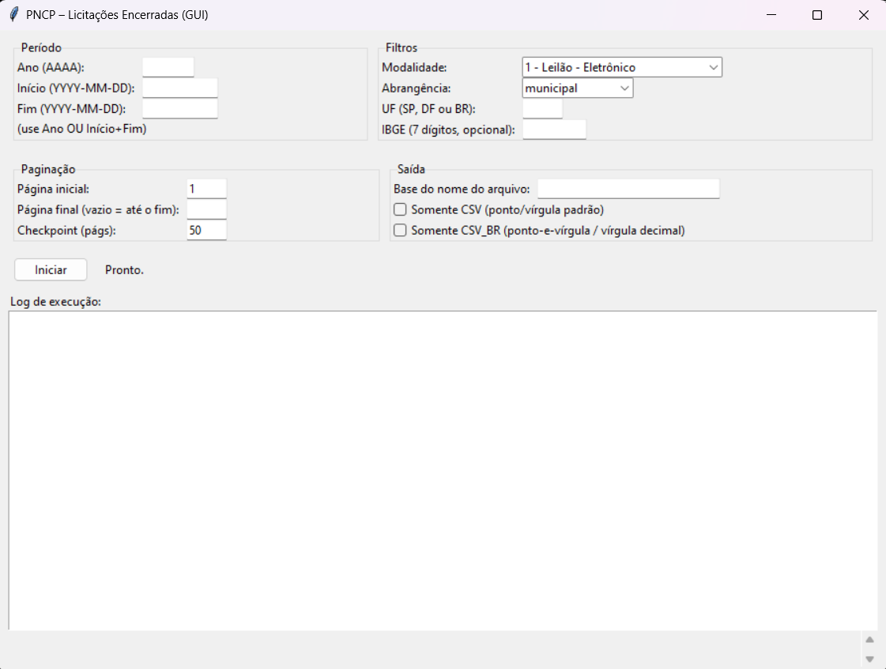

  

  
  
  
  

  
   
  <em>Tela principal da interface gráfica do Extrator PNCP</em>

# PNCP – Extrator de Licitações Encerradas (GUI)

Este repositório disponibiliza uma ferramenta completa para **extração massiva de licitações ENCERRADAS** diretamente da API pública do **Portal Nacional de Contratações Públicas (PNCP)**.  
O sistema possui interface gráfica (Tkinter), suporte a paginação avançada, filtros detalhados, processamento robusto e exportação profissional em **CSV** e **CSV_BR**, com flatten automático e normalização numérica.

A ferramenta foi projetada para pesquisas acadêmicas, análises governamentais, estudos sobre contratações públicas e consolidação de bases de dados em larga escala.

---

# ⭐ Principais Funcionalidades

### ✔ Extração SOMENTE de licitações encerradas  
Critérios automáticos:  
1. `dataEncerramentoProposta` ≤ hoje (BRT);  
2. ou `valorTotalHomologado > 0`;  
3. ou situação ∈ {revogada, anulada, suspensa}.

### ✔ Filtros avançados  
• Modalidade (todas as oficiais do PNCP)  
• Abrangência: municipal, estadual, federal ou distrital  
• UF (SP, outros estados ou BR)  
• Município por código IBGE (7 dígitos)  
• Ano completo automático  
• ou intervalo personalizado (YYYY-MM-DD)

### ✔ Paginação profissional  
• Página inicial  
• Página final opcional  
• Parada automática baseada na API  
• Tamanho fixo (50 itens/página)

### ✔ Checkpoints periódicos  
Gera arquivos parciais **a cada N páginas**, aumentando robustez em extrações longas.

### ✔ Exportação em dois padrões  
**CSV (internacional):** vírgula como separador, ponto decimal  
**CSV_BR (Brasil):** ponto-e-vírgula como separador, vírgula decimal  
✔ Ideal para Excel, LibreOffice e Google Sheets

### ✔ Flatten inteligente  
Estruturas aninhadas (`dict` e `list`) viram colunas planas.

### ✔ GUI responsiva  
• Tkinter  
• Log contínuo  
• Threading (não congela a interface)  
• ETA estimado  
• Caixas de diálogo para sucesso/erro

---

# 📄 Arquivo Principal

pncp_extrator_licitacoes_encerradas.py

---

# 📦 Instalação

pip install -r requirements.txt

---

# 🚀 Como usar

python pncp_extrator_licitacoes_encerradas.py

Preencha os campos, clique em **Iniciar** e aguarde o processamento.  
Arquivos serão gerados conforme o nome-base informado:

{base}_p1-50.csv
{base}_p1-50_BR.csv

---

# 🔖 DOI

Software preservado e referenciável via Zenodo:

**https://doi.org/10.5281/zenodo.17632374**

---

# 📚 Como citar (ABNT NBR 6023:2018)

HULMANN, M. PNCP – Extrator de Licitações Encerradas. Versão 1.0.1. Software. Zenodo, 2025.
Disponível em: https://doi.org/10.5281/zenodo.17632374. Acesso em: ___ ___ _____.

---

# 📄 Licença

**MIT License** – uso e modificação permitidos.

---

# 👤 Autor

Michel Hulmann  
Mestrando em Administração Pública – IDP  
Secretaria de Administração e Governo Digital – Salto/SP
