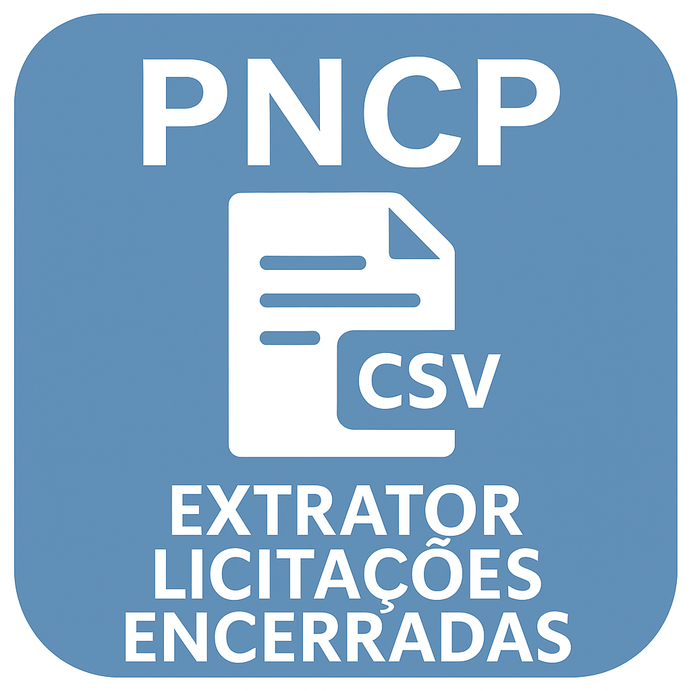

  

  
  

# PNCP -- Extrator de Licitações Encerradas (GUI)

Este repositório disponibiliza uma ferramenta completa para **extração
massiva de licitações ENCERRADAS** diretamente da API pública do
**Portal Nacional de Contratações Públicas (PNCP)**.\
O sistema possui interface gráfica (Tkinter), suporte a paginação
avançada, filtros detalhados, processamento robusto e exportação
profissional em **CSV** e **CSV_BR**, com flatten automático e
normalização numérica.

Esta ferramenta foi construída para pesquisas acadêmicas, análises
governamentais, estudos sobre contratações públicas e consolidação de
bases de dados em larga escala.

------------------------------------------------------------------------

# ⭐ Principais Funcionalidades

### ✔ Extração SOMENTE de licitações encerradas

### ✔ Filtros avançados

• Modalidade (todas as oficiais do PNCP)\
• Abrangência: municipal, estadual, federal, distrital\
• UF (SP, outros estados ou BR)\
• Município por código IBGE (7 dígitos)\
• Ano inteiro (automatizado)\
• ou intervalo personalizado (YYYY-MM-DD)

### ✔ Paginação profissional

• Página inicial\
• Página final opcional\
• Parada automática quando a API sinaliza o fim\
• Tamanho fixo (50 itens, padrão PNCP)

### ✔ Checkpoints periódicos

Salva arquivos parciais **a cada N páginas**, garantindo segurança em
extrações longas.

### ✔ Exportação em dois padrões

**CSV (internacional)**: vírgula separando colunas, ponto decimal\
**CSV_BR (Brasil)**: ponto-e-vírgula separando colunas, vírgula decimal\
✔ Ideal para Excel, LibreOffice e Google Sheets

### ✔ Flatten inteligente

Transforma estruturas aninhadas (`dict` e `list`) em colunas planas.

### ✔ GUI responsiva

• Tkinter\
• Log em tempo real\
• Execução em thread (não congela a interface)\
• ETA estimado\
• Caixas de diálogo para sucesso/erro

------------------------------------------------------------------------

# 📄 Arquivo Principal

    pncp_extrator_licitacoes_encerradas.py

------------------------------------------------------------------------

# 📦 Instalação

    pip install -r requirements.txt

------------------------------------------------------------------------

# 🚀 Como usar

    python pncp_extrator_licitacoes_encerradas.py

------------------------------------------------------------------------

# 🔖 DOI

https://doi.org/10.5281/zenodo.17632374

------------------------------------------------------------------------

# 📚 Como citar

    Hulmann, M. (2025). PNCP – Extrator de Licitações Encerradas (v1.0.1) [Software]. Zenodo. https://doi.org/10.5281/zenodo.17632374

------------------------------------------------------------------------

# 📄 Licença

MIT License

------------------------------------------------------------------------

# 👤 Autor

Michel Hulmann\
Mestrando em Administração Pública - IDP
